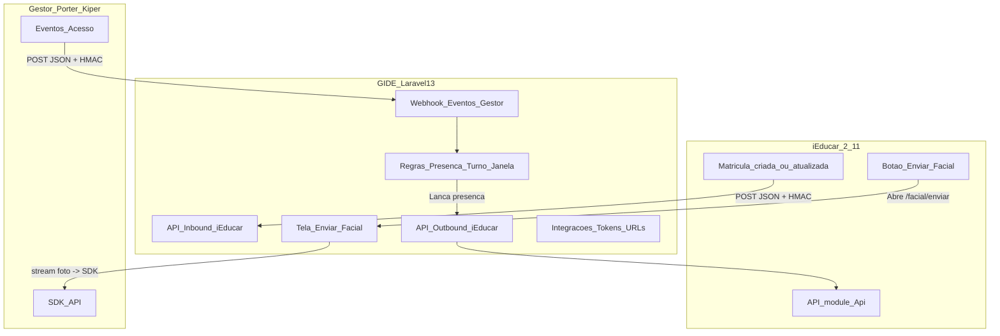

# GIDE — Bridge iEducar ↔ Gestor (Porter/Kiper SDK)

Este repositório contém o **GIDE**, um serviço (Laravel 13) que atua como **ponte** entre:

- **iEducar 2.11**: sistema origem (alunos/matrículas e presença/frequência)
- **Gestor de dados da catraca** (atualmente documentado como **Porter/Kiper SDK**): sistema destino (controle de acessos por período)

Premissa central: **todo o tráfego é via API** (sem conexão direta ao banco dos sistemas externos) e **biometria/imagem não é persistida no GIDE** (somente trafega em memória/stream quando necessário).

## Documentação

- **Fluxo ponta-a-ponta**: `docs/FLUXO_DO_SISTEMA.md`
- **Análise técnica (melhorias/gargalos)**: `docs/ANALISE_TECNICA_MELHORIAS.md`
- **Catraca → GIDE (webhook Bearer)**: `docs/CATRACA_WEBHOOK.md`
- **Comandos Artisan (referência, exemplos e simulações)**: `docs/COMANDOS_ARTISAN.md`
- **Frequência iEducar ↔ GIDE (registro / fila)**: `docs/IEDUCAR_FREQUENCIA_REGISTRO_GIDE.md`
- **WhatsApp (planeado) e notificações / referência SMS**: `docs/WHATSAPP_INTEGRACAO_NOTIFICACOES.md`

## Instalação

### Requisitos

- **PHP 8.3+** com extensões usuais do Laravel (`openssl`, `pdo`, `mbstring`, `tokenizer`, `xml`, `ctype`, `json`, `fileinfo`, etc.).
- **Base de dados**: em produção costuma ser **PostgreSQL** (`pdo_pgsql`). Para testes automatizados com SQLite em memória, é necessário **`pdo_sqlite`** habilitado no PHP do ambiente de CI/local.
- **Node.js + npm** apenas se for compilar ou desenvolver assets front-end (Vite).
- **Composer 2.x** — no servidor pode não existir o binário `composer` global; nesse caso use o **PHAR** oficial (ver passo 2).

### Passos rápidos

1. Clonar o repositório e entrar na pasta do projeto.
2. **Instalar dependências PHP** (escolha conforme o ambiente):
   - Com Composer no `PATH`:
     ```bash
     composer install
     ```
   - **Sem** `composer` no `PATH` (ex.: hospedagem mínima): obter `composer.phar` em [getcomposer.org](https://getcomposer.org/download/) e executar:
     ```bash
     php composer.phar install
     ```
3. **Configurar `.env`** (na primeira vez, a partir do modelo versionado):
   ```bash
   test -f .env || cp .env.example .env
   php artisan key:generate
   ```
   Preencha `APP_URL`, `DB_*`, `QUEUE_CONNECTION`, `APP_TIMEZONE`, etc.
4. **Migrações e (opcional) seed**:
   ```bash
   php artisan migrate
   php artisan db:seed
   ```
   O seed padrão cria integrações base e o utilizador de teste descrito em [Seed de admin (teste)](#seed-de-admin-teste).
5. **Assets front-end** (produção ou CI):
   ```bash
   npm ci
   npm run build
   ```
   Em desenvolvimento local, `npm run dev` em paralelo ao servidor PHP.
6. **Servidor de desenvolvimento**:
   ```bash
   php artisan serve
   ```
   Em produção, aponte o virtual host para `public/` e configure o agendador (`schedule:run`) e workers de fila conforme [Fila, retries e cron](#fila-retries-e-cron).

> **Nota:** o script `composer setup` definido em `composer.json` encadeia `composer install`, criação de `.env`, `key:generate`, `migrate` e build npm — exige o binário **`composer`** disponível. Em ambientes só com PHAR, reproduza os passos 2–5 manualmente com `php composer.phar install`, etc.

### PostgreSQL — sequência `users.id` após restore

Se após import/restore ocorrer erro de chave duplicada em `users_pkey` (sequência atrás do `MAX(id)`):

```bash
php artisan db:repair-users-id-sequence
```

## Administração de utilizadores e auditoria

- **Rotas** (middleware `auth` + `admin`): gestão em `/usuarios` (listar, criar, desativar/reativar, promover/rebaixar administrador) e **auditoria** em `/admin/auditoria-usuarios` (filtros por ação, utilizador auditado, paginação).
- **Autorização**: `App\Policies\UserPolicy` e *Form Requests* em `app/Http/Requests/` (`StoreUserRequest`, `DeactivateUserRequest`, `ReactivateUserRequest`, `PromoteAdminRequest`, `DemoteAdminRequest`). Nas rotas nomeadas `users.*`, falhas de autorização voltam com `redirect()->back()->withErrors(['user' => …])` para manter o mesmo fluxo das views.
- **Auditoria**: login/logout e alterações de conta escrevem em `user_audit_logs` (`App\Models\UserAuditLog`, constante `SUBJECT_USER` para alvo do tipo utilizador).

## Integrações — visão geral (`/integracoes`)

- Painel com **mapa da ponte**, fila/entregas e testes por conector. O tom dos trechos **iEducar** e **Gestor** combina configuração mínima, sinais operacionais e os **últimos testes por faixa** (persistidos em `user_integration_overview_states` + sessão). O backlog genérico de jobs entra no **resumo geral** e no segmento Gestor, **sem** pintar o iEducar apenas por fila — alinhado aos badges dos cartões de teste.

## Variáveis de ambiente

- **Credenciais e valores de ambiente** ficam somente no arquivo **`.env`** na raiz (arquivo ignorado pelo Git).
- **`.env.example`** é só **modelo versionado** (sem `APP_KEY`, sem senha de banco preenchida). Em um clone novo, se não existir `.env`, o `composer install` copia o exemplo; em seguida preencha `DB_*`, rode `php artisan key:generate` e ajuste o restante.
- Com **Docker** deste repositório, alinhe `DB_DATABASE`, `DB_USERNAME` e `DB_PASSWORD` com `POSTGRES_*` do serviço `db` em `docker-compose.yml`.
- **Datas e horários** nas telas usam `APP_TIMEZONE` (padrão `America/Sao_Paulo`, GMT-3) e texto relativo em português (`APP_LOCALE=pt_BR`). Ajuste se o servidor operar em outro fuso.

## Fila, retries e cron

- **Envio facial** (`POST /facial/enviar`): permanece **fora da fila** (processamento síncrono na requisição; imagem não fica persistida no GIDE).
- **Matrícula → Gestor** e **SMS pós-presença** usam jobs (`SendEnrollmentToAccessControl`, `SendPresenceSms`) na conexão `QUEUE_CONNECTION` (padrão `database`).
- Quando a API externa falha, `outbound_deliveries` / `sms_deliveries` guardam `next_retry_at`; o comando **`php artisan gide:deliveries:retry-due`** re-enfileira tentativas vencidas (use `--recover-stale` se suspeitar de job nunca consumido).
- **`php artisan gide:queue:work-once`** drena **um** job por execução (útil em cron sem daemon `queue:work`).
- Agendamento Laravel (rodar **`php artisan schedule:run` a cada minuto** no servidor, ex.: crontab — horário do **servidor**; o log dos comandos inclui linha **Referência** em `America/Sao_Paulo` / GMT-3): já registra `gide:deliveries:retry-due` e `gide:queue:work-once` em `routes/console.php`.
- Limites: `GIDE_DELIVERY_MAX_ATTEMPTS`, `GIDE_DELIVERY_STALE_MINUTES` e `config/gide.php`. Estado consolidado de outbound: coluna **`delivery_status`** (`pending`, `retry_scheduled`, `completed`, `failed`). Painel **`/integracoes`** mostra contagens e fila `jobs`.

## Documento executivo (plano)

O plano executivo detalhado (objetivo, fluxograma, MVP, riscos, estimativa) é mantido **fora do repositório** (ferramentas internas / planeamento local). O ficheiro `EXECUTIVO` na raiz resume requisitos e comandos úteis para o contexto do projeto.

## Fluxo ponta-a-ponta (resumo)



## Rotas implementadas no GIDE

### Web

- **`GET /`**: home
- **`GET /login` / `POST /login`**: login (por `username`)
- **`POST /logout`**
- **`GET /dashboard`** (protegida por `auth`)
- **`GET /integracoes`**: visão geral das integrações, fila e mapa da ponte (`auth`)
- **`GET /facial/enviar`** (protegida por `auth`): tela alvo do botão no iEducar
- **`POST /facial/enviar`** (protegida por `auth`): executa envio (stream)
- **`GET /usuarios`**, **`GET /usuarios/novo`**, **`POST /usuarios`**, ações POST em `usuarios/{user}/…` (protegidas por `auth` + `admin`): gestão de utilizadores GIDE
- **`GET /admin/auditoria-usuarios`** (`auth` + `admin`): auditoria de contas e sessões
- **`GET /admin/gestor-access-events`**, **`GET /admin/gestor-access-events/{id}`** (`auth` + `admin`): auditoria de entregas do webhook Gestor (HMAC)
- **`GET /integracoes/ieducar`**, **`GET /integracoes/gestor`**, **`GET /integracoes/sms`**, **`GET /integracoes/ieducar/frequencia-registro`**, painéis admin de facial e de entregas de frequência (`auth` + `admin` onde aplicável — ver `routes/web.php`)

### API (v1)

Arquivo: `routes/api.php`

- **`POST /api/v1/ieducar/enrollments`**
  - Middleware: `verify.hmac:ieducar`
  - Persistência para auditoria: `enrollment_ingests` (`App\\Models\\EnrollmentIngest`)
  - Outbound (assíncrono): se `gestor` estiver habilitado e `integrations.extra.endpoints.enrollment_sync_path` estiver configurado, o GIDE envia o payload para o Gestor e registra em `outbound_deliveries`.
- **`POST /api/v1/ieducar/facial-requests`**
  - Middleware: `verify.hmac:ieducar`
  - Cria requisição/token para abrir `GET /facial/enviar?token=...` (somente esse fluxo permite envio ao Gestor)
- **`POST /api/v1/gestor/access-events`**
  - Middleware: `verify.hmac:gestor` — cabeçalhos `X-Event-Id`, `X-Timestamp`, `X-Signature`; o corpo JSON é coberto pela assinatura (ver `VerifyHmacSignature`).
  - Persistência: `access_events` (`App\\Models\\AccessEvent`) e linha de auditoria em `gestor_access_event_deliveries`.
  - Resposta JSON inclui `delivery_id` para correlação com `GET /admin/gestor-access-events`.
  - **`POST /api/v1/catraca/access-events`**: catraca com **Bearer** (`Authorization` + JSON); token em `integrations.extra.catraca_access_token_hash` (ver `App\Support\GestorCatracaAccessToken` e **`docs/CATRACA_WEBHOOK.md`**). Mesma auditoria admin que o fluxo HMAC.

## Segurança entre sistemas (HMAC inbound)

Middleware: `app/Http/Middleware/VerifyHmacSignature.php`

Headers obrigatórios (para chamadas **inbound** ao GIDE):

- `X-Event-Id`: identificador único do evento (idempotência)
- `X-Timestamp`: epoch seconds
- `X-Signature`: `HMAC_SHA256(secret, "{timestamp}.{eventId}.{rawBody}")`

Configuração por integração (tabela `integrations`):

- `integrations.hmac_secret`
- `integrations.signature_ttl_seconds`
- `integrations.enabled=true`

## Integrações (configuração)

Tabela: `integrations` (`App\\Models\\Integration`)

Seeder: `database/seeders/IntegrationSeeder.php` (cria `key=ieducar` e `key=gestor`, por padrão `enabled=false`).

Campos importantes:

- **`key`**: `ieducar` | `gestor`
- **`base_url`**: URL base do sistema
- **`enabled`**: habilita consumo/validação
- **`auth_token` / `hmac_secret` / `extra`**: **criptografados** no banco (Laravel encrypted casts)

### iEducar (`key=ieducar`)

No MVP, o GIDE usa:

- `extra.access_key`: token do iEducar (para API `/module/Api/...`)
- `extra.photo_url_template`: template para obter a foto do aluno (se existir); use a URL base da **sua** instância iEducar, ex.: `{ORIGEM_IEDUCAR}/.../foto/{aluno_id}` (sem fixar domínio no repositório)
- `extra.presence.windows`: janelas por turno (ver seção “Presença”)

Client: `app/Services/Ieducar/IeducarClient.php`

### Gestor (Porter/Kiper SDK) (`key=gestor`)

No MVP, o GIDE usa:

- `base_url`: apenas via `/integracoes/gestor` (banco); não há fallback em `.env` para Gestor
- `extra.application_key`: valor do header obrigatório `ApplicationKey`
- `extra.auth.username` / `extra.auth.password`: credenciais para `/Auth/Signin`
- `extra.endpoints.enrollment_sync_path`: path do POST de convite (ex. `/SDK/Invite`), só banco
- `extra.defaults.unity_id` / `extra.defaults.access_profile_id` (ou `extra.onboarding.*`): inteiros **> 0**; **0** ou vazio é ignorado (como não configurado)
- `extra.onboarding.condominium_id`: filtro para Unities

Client: `app/Services/Gestor/GestorClient.php`

### SMS (`key=sms`)

Autenticação:

- Header: `X-API-TOKEN: <token>` (armazenado em `integrations.auth_token`)
- Base URL: integração `sms` no banco ou `SMS_DEFAULT_BASE_URL` no `.env` (`config/integrations.php`; padrão de desenvolvimento documentado lá, não no código da aplicação)

Envio:

- Endpoint: `POST /channels/sms/messages`
- Campos principais: `from`, `to`, `contents[0].text`

Template:

- Tabela: `sms_templates` (`key=presence_notification`)
- View admin: `GET /integracoes/sms`

Logs/entregas:

- Tabela: `sms_deliveries` (idempotência por `event_id + template_key + to`)
- Traz rastreio para auditoria (aluno/matrícula/janela/tipo/status/HTTP/response JSON)
- UI admin:
  - `GET /sms` lista com filtros
  - `GET /sms/{id}` detalhe com contexto e resposta do provedor

## Seed de admin (teste)

Seeder: `database/seeders/User1Seeder.php` (executado por padrão no `DatabaseSeeder`).

Usuário padrão:

- `username`: `jadergabriel`
- `password`: `123456789`

Flags via env:

- `USER1_IS_ADMIN` (default `true`)
- `USER1_EMAIL_VERIFIED` (default `true`)

## Gestor (Porter/Kiper SDK) — APIs conhecidas (documentadas)

### Autenticação

- **`POST {base_url}/Auth/Signin`**
  - Body: `{"username": "...", "password": "..."}` (conforme SDK)
  - Retorno esperado: `token` (ou `access_token`)
  - Uso: `Authorization: Bearer <token>`

Implementação: `GestorClient::signIn()`

### Headers obrigatórios (todas as rotas do SDK)

- `Authorization: Bearer <token>`
- `ApplicationKey: <application_key>`

### Unity

1) **Listar Unities por CondominiumId**

- **`GET {base_url}/SDK/Unity`**
  - Query:
    - `include=UnityGroup`
    - `include=Condominium`
    - `where=w.Condominium.Id={condominiumId}`

Implementação: `GestorClient::listUnitiesByCondominium($condominiumId)`

1) **Buscar Unity por Id**

- **`GET {base_url}/SDK/unity/{id}`**
  - Query:
    - `include=UnityGroup`
    - `include=Condominium`

Implementação: `GestorClient::getUnityById($id)`

1) **Listar todas as Unities do usuário**

- **`GET {base_url}/SDK/Unity`**
  - Query:
    - `include=UnityGroup`
    - `include=Condominium`

Implementação: `GestorClient::listUnitiesAll()`

## Envio de facial (sem persistência)

Tela:

- `POST /api/v1/ieducar/facial-requests` (inbound, HMAC) cria um token/URL
- `GET /facial/enviar?token=...` (auth) abre a tela autorizada
- `POST /facial/enviar` (auth) executa o envio **somente** com `request_token` válido

Fluxo (MVP):

1. Capturar foto pela câmera do dispositivo no browser (WebRTC `getUserMedia`) e enviar como `Blob` (sem salvar no dispositivo), **ou** buscar foto do aluno via streaming (sem salvar em disco) usando `IeducarPhotoSource`
2. Repassar o stream ao client do Gestor (depende do endpoint final de enroll facial no SDK)
3. Quando o enroll for aceito pelo Gestor, calcular a validade (datetime) e chamar um endpoint do iEducar (se configurado) informando `valid_until`.

Regras de segurança do fluxo:

- O envio ao Gestor é **bloqueado** se a tela for aberta sem token (modo teste/admin).
- O token de envio facial expira e é consumido em sucesso (`used_at`).

Código:

- `app/Services/Photo/IeducarPhotoSource.php`
- `app/Http/Controllers/Web/FacialSendController.php`
- `app/Services/Gestor/GestorClient.php` (usa `integrations.extra.endpoints.face_enroll_path`)
- `app/Services/Ieducar/IeducarClient.php` (`postFacialValidity`, usa `integrations.extra.facial.validity_path` + Bearer token)

## Presença (turno/janelas) — base técnica

Engine: `app/Services/Presence/PresenceRuleEngine.php`

Config (exemplo em `integrations.extra.presence`):

- `ignore_exit_events`: ignora eventos “saída”
- `windows`: janelas por turno (ex.: manhã/tarde/noite)
- `payload_map`: mapeia chaves do payload do Gestor para `aluno_id`, `matricula_id`, `event_type`

Lançamento no iEducar:

- Preparado em `app/Services/Presence/PresenceMarker.php`
- Usa API do Diário (faltas) via `IeducarClient`:
  - `POST /module/Api/Diario?oper=post&resource=faltas-geral`
  - `POST /module/Api/Diario?oper=post&resource=faltas-por-componente`

Observação: para lançar efetivamente faltas/presença, é necessário enriquecer o evento com `instituicao_id`, `etapa` e estrutura `turmas[...]` conforme API do iEducar.

## Testes automatizados

- **Requisito**: extensão PHP **`pdo_sqlite`** para qualquer teste que use `RefreshDatabase` (o `phpunit.xml` usa SQLite em memória). Alguns testes de **convidado** (ex.: `GET /login`, redirecionamento de `/integracoes`) não usam base de dados e **executam mesmo sem** `pdo_sqlite`.
- **Suíte completa** (igual ao CI típico):
  ```bash
  php artisan test
  ```
  ou `composer test`.
- **Por tema (telas / API / fluxo)**: comando Artisan **`gide:test`**, que repassa grupos PHPUnit (`--group`):
  ```bash
  php artisan gide:test --list
  php artisan gide:test --theme=telas-auth
  php artisan gide:test --theme=telas-users,telas-auditoria
  php artisan gide:test --theme=api-ieducar --theme=fluxo-frequencia
  ```
  Temas suportados: `telas-publico`, `telas-auth`, `telas-users`, `telas-auditoria`, `telas-integracoes`, `telas-dashboard`, `telas-sms`, `api-ieducar`, `api-gestor`, `api-catraca`, `api-catraca-webhook`, `fluxo-enrollment`, `fluxo-frequencia`, `unit`.
- **CI (GitHub Actions)**: workflow `.github/workflows/tests.yml` usa **PHP 8.3** com extensões **`pdo_sqlite` / `sqlite3`** declaradas e corre `php artisan gide:test` (mesmo ambiente que `phpunit.xml`: SQLite em memória).
- **Relatório por cenário** (testes que usam `reportStructuredTestOutcome` / `assert*WithReport` em `tests/TestCase.php`): na consola aparece um bloco **Resumo do cenário** com *o que se testou*, *objetivo*, *esperado*, *obtido* e *EXITOSO* ou *FALHOU* (este último também antes da mensagem PHPUnit em falhas de HTTP). Controlado por `TEST_STRUCTURED_OUTCOME` no `phpunit.xml` (`0` para desligar). Em `gide:test`: opção **`--testdox`** (frases PHPUnit) e **`--no-structured-outcome`** (equivale a desligar os blocos).
- **Código**: cenários em `tests/Feature/Telas/`, `tests/Feature/Api/`, `tests/Feature/Fluxo/` e helper `tests/Support/HmacJsonRequest.php`.

## Comandos úteis

- **Fluxo iEducar pós-facial (consulta + confirmação + frequência com `meta.preview` ligado ao Gestor)** — ver `docs/IEDUCAR_FACIAL_CATRACA_FLOW_TEST.md`:

```bash
php artisan ieducar:facial-catraca-flow:test --help
php artisan ieducar:facial-catraca-flow:test 211 --idpes=12345678
```

- **Importar Postman (Gestor)**:

```bash
php artisan gestor:import-postman /caminho/collection.json
```

- **Criptografar integrações já existentes (migração de dados)**:

```bash
php artisan integrations:encrypt-existing --dry-run
php artisan integrations:encrypt-existing
```

## Próximos passos (dependem de mais endpoints do Gestor)

Para completar o fluxo real do “Invite/Guests” e biometria, faltam os endpoints/documentação de:

- criação/atualização/deleção de **Invite**
- criação/atualização/deleção de **Guests**
- como biometria facial é cadastrada/atualizada/deletada
- como eventos de acesso/presença são emitidos (webhook/polling/payload)

<p align="center"><a href="https://laravel.com" target="_blank"></a></p>

<p align="center">
<a href="https://github.com/laravel/framework/actions"></a>
<a href="https://packagist.org/packages/laravel/framework"></a>
<a href="https://packagist.org/packages/laravel/framework"></a>
<a href="https://packagist.org/packages/laravel/framework"></a>
</p>

## About Laravel

Laravel is a web application framework with expressive, elegant syntax. We believe development must be an enjoyable and creative experience to be truly fulfilling. Laravel takes the pain out of development by easing common tasks used in many web projects, such as:

- [Simple, fast routing engine](https://laravel.com/docs/routing).
- [Powerful dependency injection container](https://laravel.com/docs/container).
- Multiple back-ends for [session](https://laravel.com/docs/session) and [cache](https://laravel.com/docs/cache) storage.
- Expressive, intuitive [database ORM](https://laravel.com/docs/eloquent).
- Database agnostic [schema migrations](https://laravel.com/docs/migrations).
- [Robust background job processing](https://laravel.com/docs/queues).
- [Real-time event broadcasting](https://laravel.com/docs/broadcasting).

Laravel is accessible, powerful, and provides tools required for large, robust applications.

## Learning Laravel

Laravel has the most extensive and thorough [documentation](https://laravel.com/docs) and video tutorial library of all modern web application frameworks, making it a breeze to get started with the framework.

In addition, [Laracasts](https://laracasts.com) contains thousands of video tutorials on a range of topics including Laravel, modern PHP, unit testing, and JavaScript. Boost your skills by digging into our comprehensive video library.

You can also watch bite-sized lessons with real-world projects on [Laravel Learn](https://laravel.com/learn), where you will be guided through building a Laravel application from scratch while learning PHP fundamentals.

## Agentic Development

Laravel's predictable structure and conventions make it ideal for AI coding agents like Claude Code, Cursor, and GitHub Copilot. Install [Laravel Boost](https://laravel.com/docs/ai) to supercharge your AI workflow:

```bash
composer require laravel/boost --dev

php artisan boost:install
```

Boost provides your agent 15+ tools and skills that help agents build Laravel applications while following best practices.

## Contributing

Thank you for considering contributing to the Laravel framework! The contribution guide can be found in the [Laravel documentation](https://laravel.com/docs/contributions).

## Code of Conduct

In order to ensure that the Laravel community is welcoming to all, please review and abide by the [Code of Conduct](https://laravel.com/docs/contributions#code-of-conduct).

## Security Vulnerabilities

If you discover a security vulnerability within Laravel, please send an e-mail to Taylor Otwell via [taylor@laravel.com](mailto:taylor@laravel.com). All security vulnerabilities will be promptly addressed.

## License

The Laravel framework is open-sourced software licensed under the [MIT license](https://opensource.org/licenses/MIT).
